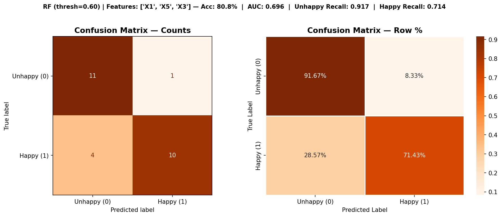
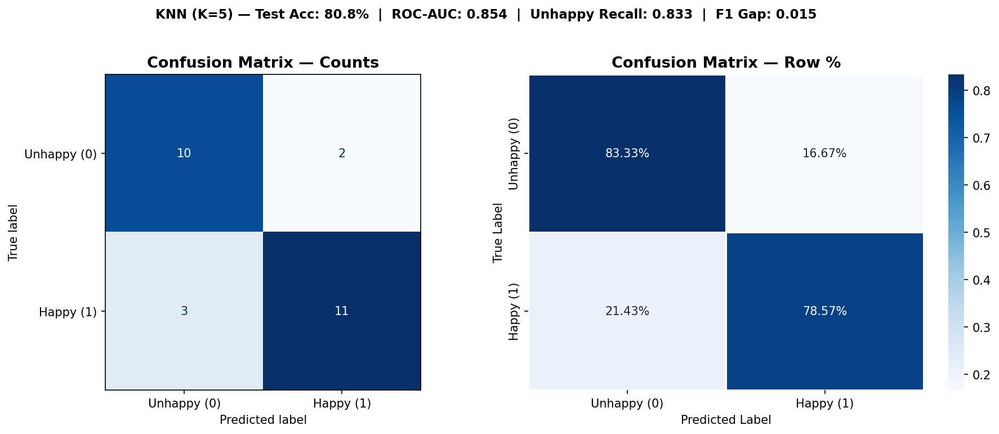
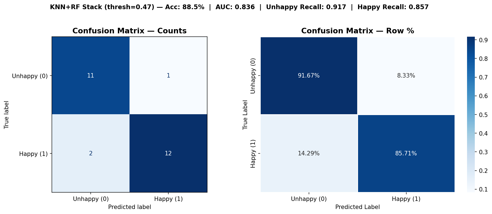

# Customer Unhappiness Prediction
### Logistics & Delivery — Survey 2020

---

## The Business Problem

ACME is one of the fastest-growing startups in the logistics and delivery domain. As part of a global expansion strategy, the company ran a customer satisfaction survey to understand what makes customers happy or unhappy. The goal was simple — if we can predict unhappiness before a customer churns, we can act on it.

The dataset contains 126 survey responses with six questions rated 1–5 and a binary target: **1 = Happy, 0 = Unhappy**.

| Feature | Question |
|---|---|
| X1 | My order was delivered on time |
| X2 | Contents of my order were as I expected |
| X3 | I ordered everything I wanted to order |
| X4 | I paid a good price for my order |
| X5 | I am satisfied with my courier |
| X6 | The app makes ordering easy for me |


## The Journey — How We Got to the Final Model

### Step 1 — Understanding the Data
> 📓 [`CustomerHappiness_EDA_Modelling.ipynb`](CustomerHappiness_EDA_Modelling.ipynb)

Before any modelling, we ran three independent statistical tests to identify which features actually carry signal:

- **Point-Biserial Correlation** — numeric feature vs binary target
- **Chi-Square Test** — categorical response vs target
- **Random Forest Feature Importance** — tree-based signal ranking

**Result:** X4 (price) and X6 (app) were eliminated across all three methods. They are noise. The four features that matter are X1, X2, X3, and X5.

This was the first important business finding — customers don't care enough about price or app usability to let it drive their overall happiness. What drives it is the delivery experience and whether they got what they came for.

---

### Step 2 — The Models That Didn't Make It
> 📓 [`Failed_models.ipynb`](Failed_models.ipynb)

Before arriving at the final answer, six models were attempted. Each taught us something, but none achieved a satisfactory balance between Unhappy and Happy recall simultaneously.

| Model | What it did | Why it failed |
|---|---|---|
| **SVM** | Strong boundary classifier | Poor Unhappy Recall on imbalanced data, sensitive to feature scale |
| **Gradient Boosting** | Ensemble of weak learners | Overfit to Happy majority, Unhappy Recall too low |
| **XGBoost** | Gradient boosting with regularisation | Better but F1 gap too wide — biased toward one class |
| **CatBoost** | Gradient boosting with categorical handling | Good AUC but Unhappy Recall inconsistent across folds |
| **LightGBM** | Fast gradient boosting with Hyperopt tuning | When tuned for Unhappy it sacrificed Happy recall completely |
| **MLP Neural Network** | Deep learning approach | Too aggressive on imbalance weighting — predicted almost everything Unhappy |

The shared problem across all six: they each excelled at one class but couldn't balance both. Gradient boosting models (XGBoost, LightGBM, CatBoost) naturally favour the majority class (Happy). When forced toward Unhappy via class weights or `is_unbalance`, they overcorrected. MLP suffered from the same gradient amplification problem across epochs.

The key insight from this phase — **the problem wasn't the algorithm, it was that a single model with a single feature set cannot be a specialist in both classes at once.**

---

### Step 3 — Random Forest
> 📓 [`CustomerHappiness_EDA_Modelling.ipynb`](CustomerHappiness_EDA_Modelling.ipynb) — *RF section*

Random Forest with `class_weight='balanced'` and manual feature selection (X1, X3, X5) gave the best single-model Unhappy Recall of the entire project.

**Why X1, X3, X5?**
- X1 (on time) + X5 (courier) = the delivery baseline. Low on both = almost always Unhappy.
- X3 (ordered everything wanted) = the **pre-delivery frustration signal**. If a customer couldn't get what they wanted at the ordering stage, even a perfect delivery doesn't recover their satisfaction.

**Confusion Matrix — Random Forest (X1, X3, X5)**



```
Unhappy Recall : 0.917  (11/12 caught)
Happy   Recall : 0.714  (10/14 caught)
Accuracy       : 80.8%
F1 Gap         : 0.097
```

RF was excellent at catching unhappy customers but left 4 happy customers misclassified. The model was leaning too hard toward Unhappy — understandable given `class_weight='balanced'`, but not acceptable for production use where happy customers matter too.

---

### Step 4 — KNN
> 📓 [`CustomerHappiness_EDA_Modelling.ipynb`](CustomerHappiness_EDA_Modelling.ipynb) — *KNN section*

KNN with RFE via LinearSVC proxy selected X1, X2, X5. At K=13 with `weights='distance'` it showed a different strength profile to RF — better Happy Recall.

**Why X1, X2, X5?**
- X1 (on time) + X5 (courier) = the same baseline.
- X2 (contents as expected) = the **post-delivery confirmation signal**. When a customer opens their box and gets exactly what they ordered, the experience seals positively. KNN clusters customers who score similarly on all three — and that cluster is strongly Happy.

**Confusion Matrix — KNN (K=13, X1, X2, X5)**



```
Unhappy Recall : 0.917  (11/12 caught)
Happy   Recall : 0.786  (11/14 caught)
Accuracy       : 84.6%
```

KNN independently matched RF on Unhappy Recall while also doing better on Happy. But it still left 3 happy customers wrong. No single model was the complete answer.

---

### Step 5 — The Insight: Two Moments, Two Models

Looking at what each model used:

```
RF  uses X3 → pre-delivery frustration  → Unhappy specialist
KNN uses X2 → post-delivery relief      → Happy specialist
Both use X1 + X5 → the shared baseline
```

These are two completely separate moments in the customer journey. X3 is what happens at the **ordering stage**. X2 is what happens at the **doorstep**. No single model could hold both signals equally well because they point in opposite directions — one catches the dissatisfied, the other confirms the satisfied.

The solution: **train both models on their own feature sets and combine their output probabilities**.

---

### Step 6 — KNN + RF Soft-Vote Ensemble (Final Model)
> 📓 [`CustomerHappiness_EDA_Modelling.ipynb`](CustomerHappiness_EDA_Modelling.ipynb) — *Stacking section*

The ensemble uses a weighted soft vote — each model outputs a `P(Happy)` probability independently, and those probabilities are averaged with equal weights (2:2). A threshold sweep from 0.20–0.80 found the optimal decision boundary at **0.47** (slightly below the default 0.50), meaning the model needs slightly less confidence to call someone Happy — which helped recover the 4 Happy customers RF kept misclassifying.

```
Final P(Happy) = (2 × KNN_prob + 2 × RF_prob) / 4
Threshold      = 0.47  →  if P(Happy) ≥ 0.47, predict Happy
```

**Confusion Matrix — KNN + RF Ensemble (threshold = 0.47)**



```
Unhappy Recall : 0.917  (11/12 caught)   ← held from RF
Happy   Recall : 0.857  (12/14 caught)   ← gained from KNN
Accuracy       : 88.5%                   ← best of all models
ROC-AUC        : 0.836
F1 Gap         : 0.009                   ← essentially zero bias
```

The ensemble kept RF's Unhappy strength and added KNN's Happy strength. The two models were making different errors — combining them cancelled those errors out.

---

## Results Summary

| Model | Unhappy Recall | Happy Recall | Accuracy | F1 Gap |
|---|---|---|---|---|
| SVM | poor | moderate | ~65% | high |
| Gradient Boosting | low | high | ~69% | high |
| XGBoost | moderate | moderate | ~69% | 0.097 |
| CatBoost | moderate | moderate | ~73% | variable |
| LightGBM | high | low | ~69% | high |
| MLP Neural Network | very high | very low | ~65% | extreme |
| **Random Forest** | **0.917** | 0.714 | 80.8% | 0.097 |
| **KNN** | **0.917** | 0.786 | 84.6% | 0.048 |
| **KNN + RF Stack** ✅ | **0.917** | **0.857** | **88.5%** | **0.009** |

---

## Key Business Findings

1. **Delivery timing (X1) and courier quality (X5) are non-negotiable.** Customers who score low on both are almost always unhappy — no other feature compensates for this.

2. **The Unhappy trigger is pre-delivery (X3).** "I couldn't order everything I wanted" is a catalogue and stock problem, not a delivery problem. Fixing delivery won't fix this — it requires upstream supply-side action.

3. **The Happy seal happens at the doorstep (X2).** Receiving exactly what was ordered is the moment a customer's experience turns positive. Substitutions or incorrect items break this even when everything else went right.

4. **Price (X4) and app (X6) are not current pain points.** Both were statistically eliminated as noise. This may change post-expansion into new markets.

5. **The model catches 11 of every 12 unhappy customers** from their survey response alone — enabling proactive service recovery before they churn.

---

## How to Run

```bash
# Clone the repo
git clone https://github.com/yourusername/yourrepo.git
cd yourrepo

# Install dependencies
pip install pandas numpy matplotlib seaborn scikit-learn xgboost lightgbm catboost hyperopt

# Open the main notebook
jupyter notebook CustomerHappiness_EDA_Modelling.ipynb

# Open the failed models notebook
jupyter notebook Failed_models.ipynb
```

---

*Logistics & Delivery | Customer Happiness Survey 2020*